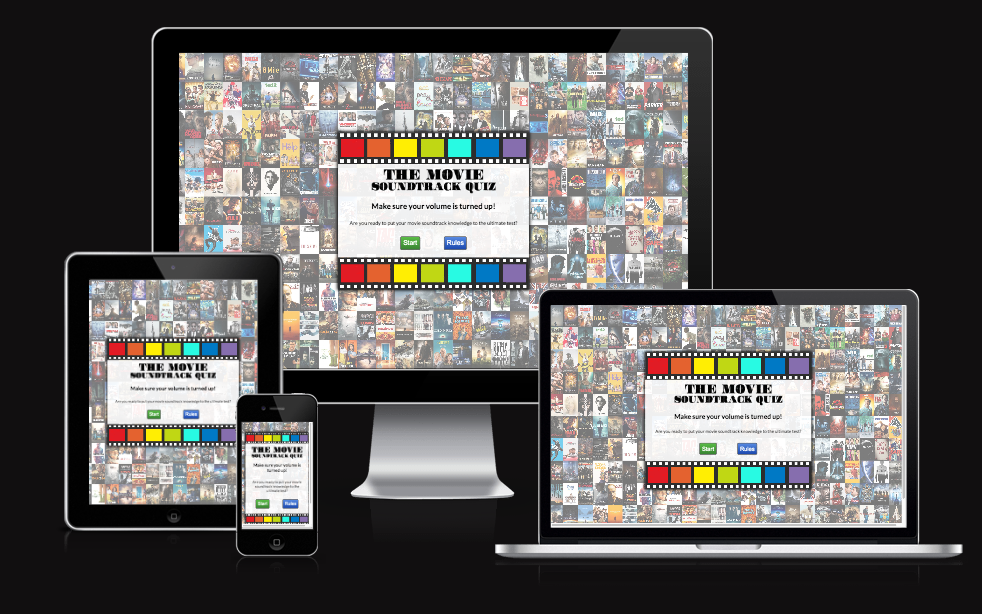
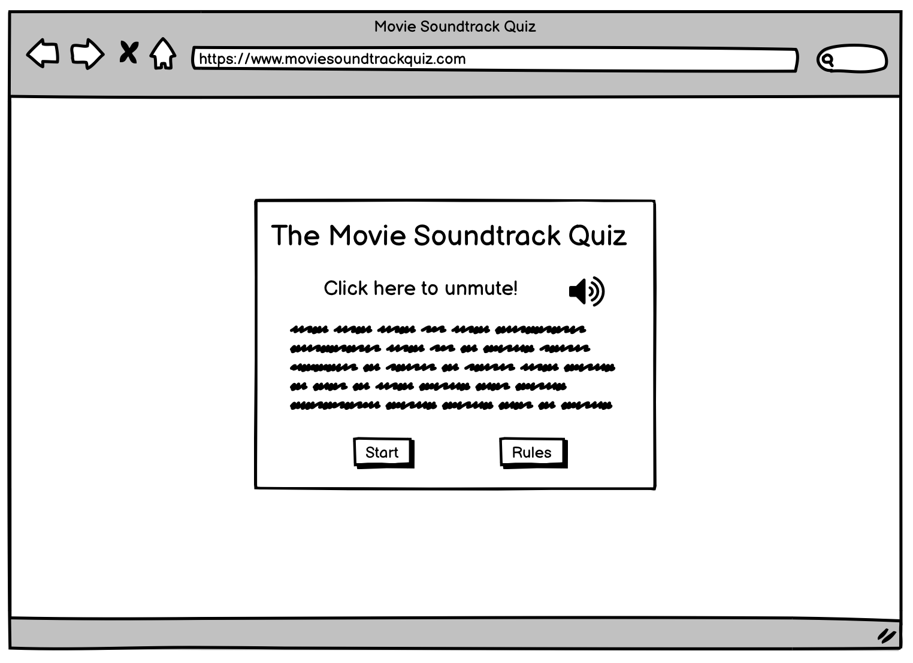
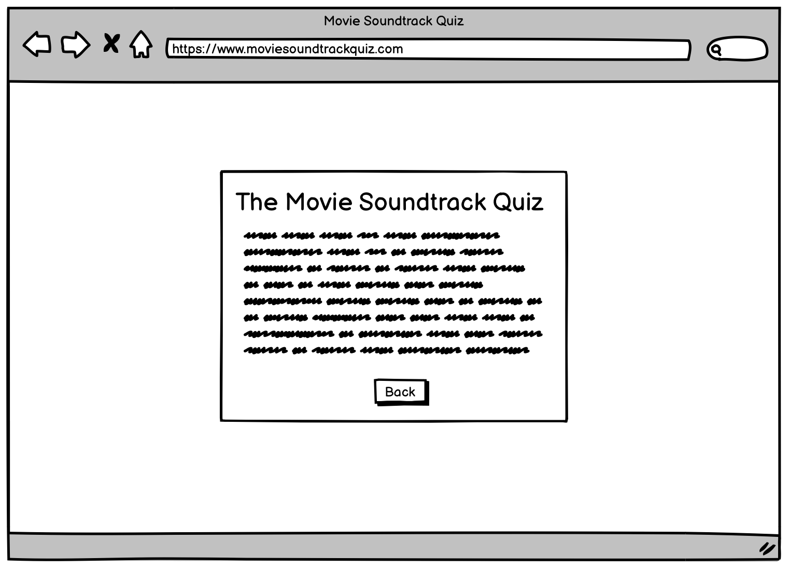
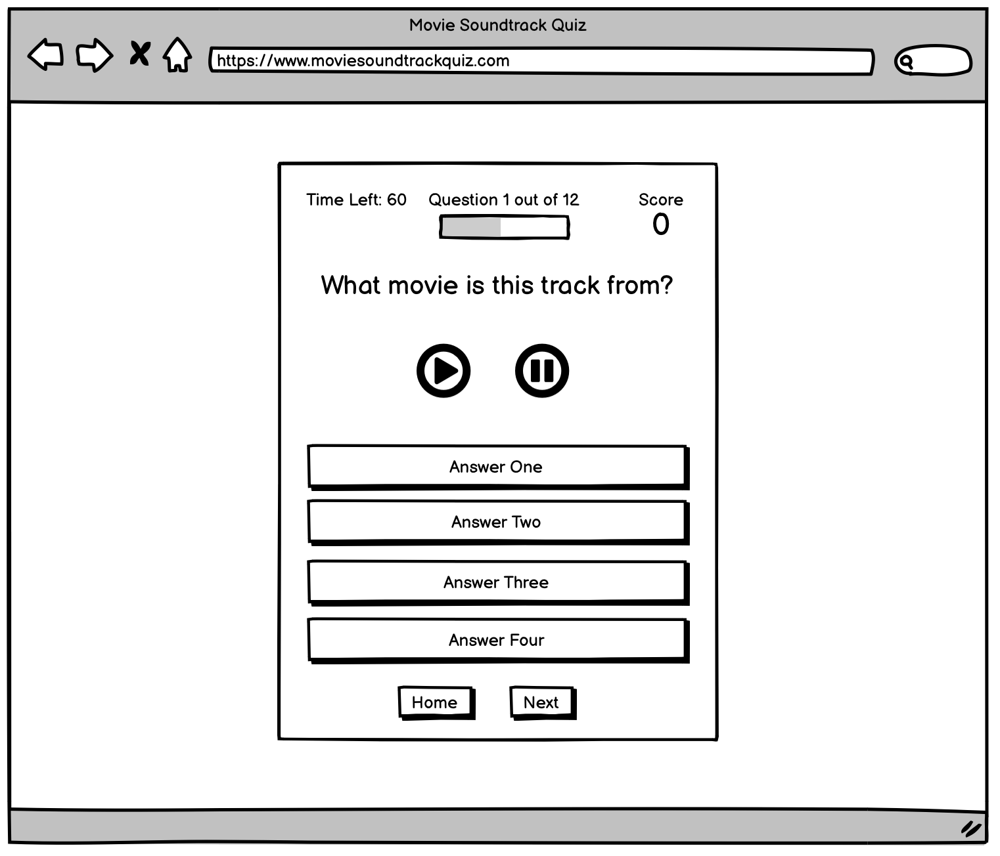
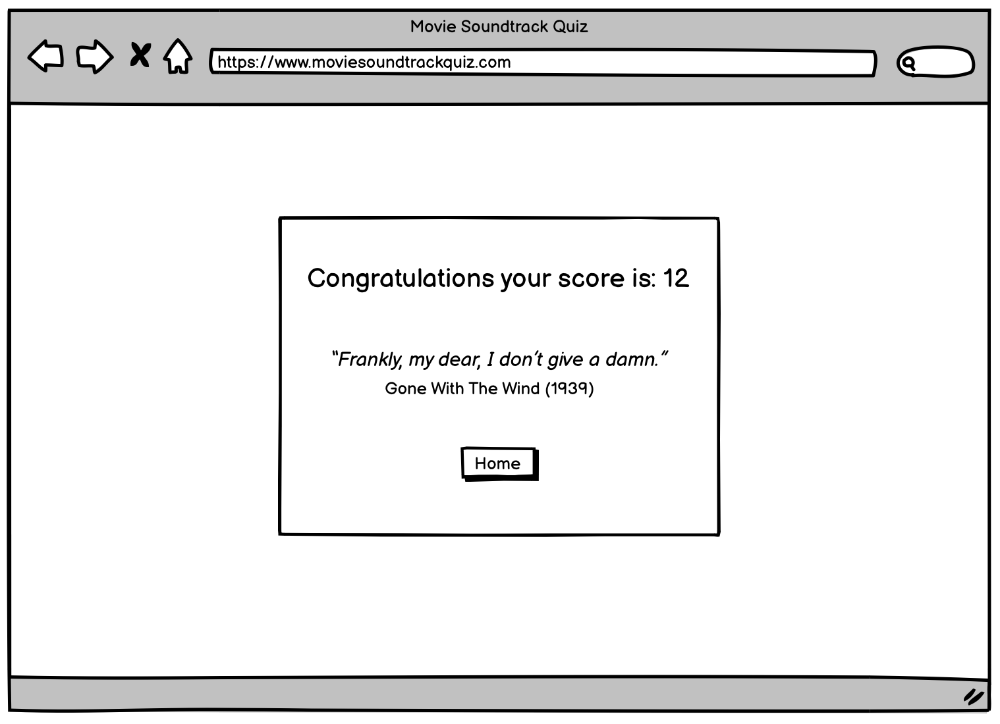
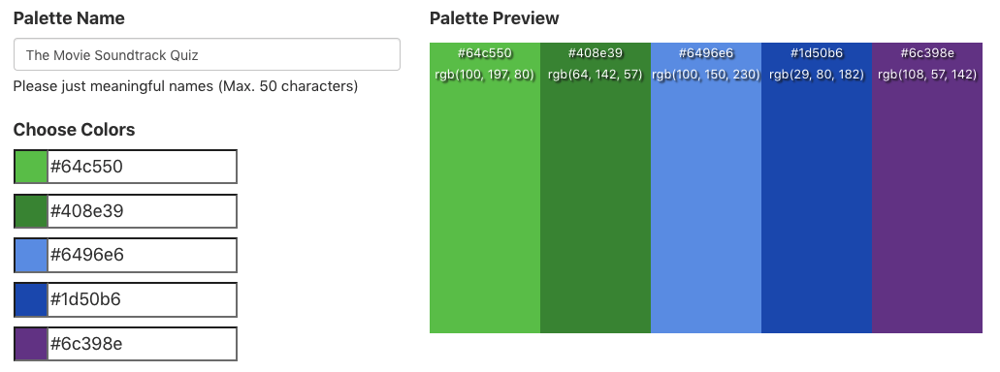

# **_The Movie Soundtrack Quiz_**

The Movie Soundtrack Quiz is an online quiz where a user can test their movie soundtrack knowledge with a fun interactive game. 

The target audience is any movie fans with an interest in music or vice versa. The audience will mostly include teens and above. The majority of the audience will be middle aged men and women. 

The goal of this online quiz is to provide a fun and interactive game where users can test their knowledge about movie soundtracks for entertainment purposes. The layout should be easily accessible and intuitive for new users. The quiz content should be challenging and engaging to encourage repeated play throughs. Information should be well structured and presented. Navigation and interactive elements should be intuitive with clear purpose and functionality. The project should conform to the best practices of user experience design, accessibility and responsivity. 

Link to the live site - [The Movie Soundtrack Quiz](https://matthew-hurrell.github.io/movie-soundtrack-quiz/)

# Contents

* [**User Experience UX**](<#user-experience-ux>)
    * [User Stories](<#user-stories>)
    * [Wireframes](<#wireframes>)
    * [Site Structure](<#site-structure>)
    * [Design Choices](<#design-choices>)
    * [Typography](<#typography>)
    * [Colour Scheme](<#colour-scheme>)
* [**Features**](<#features>)
   
    * [**Future Features**](<#future-features>)
* [**Technologies Used**](<#technologies-used>)
* [**Testing**](<#testing>)
     * [**Validator Tests**](<#validator-tests>)
     * [**Responsiveness Tests**](<#responsiveness-tests>)
     * [**Lighthouse Tests**](<#lighthouse-tests>)
     * [**Browser Tests**](<#browser-tests>)
     * [**Bugs**](<#bugs>)
* [**Deployment**](<#deployment>)
     * [**Project Deployment Via GitHub**](<#project-deployment-via-github>)
     * [**How to Fork a Repository Via GitHub**](<#how-to-fork-a-repository-via-github>)  
     * [**How to Create a Local Clone of a Project**](<#how-to-create-a-local-clone-of-a-project>)   
* [**Credits**](<#credits>)
    * [**Content**](<#content>)
    * [**Media**](<#media>)
*  [**Acknowledgements**](<#acknowledgements>)

# User Experience UX

## User Stories

* As a user I want to be able to fully understand the purpose of The Movie Soundtrack Quiz from the first page.
* As a user I want to be prompted to turn up/on my device volume before starting the quiz.
* As a user I want to be able to see a brief list of rules before starting the quiz.
* As a user I want the quiz content to be challenging but not impossible. 
* As a user I want the audio for each question to autoplay, but also have control over pausing and playing the audio.
* As a user I want each question to have a time limit which is fair but also challenging.
* As a user I want the audio to continue playing when I make my choice, or if the timer runs out, so I can continue to listen to the track until continuing to the next question.
* As a user I want to be lead through the quiz with intuitive and easy to understand navigation.
* As a user I want the quiz to look eye catching and professional.
* As a user I want a progress bar and question countdown which gives me a visual reminder of where I am in the quiz.
* As a user I want a score counter which automatically counts and displays my score during and at the end of the quiz.
* As a user I want to be shown visually if I have selected the right answer, and if I have not I wish to be shown the correct answer for each question before moving on.
* As a user I want to be able to navigate out of the quiz to the home page at any time.
* As a user I want to be able to replay the quiz multiple times and be presented with different questions. 
* As a user I want the audio to be clear and of good sound quality.
* As a user I want the quiz content to be diverse.
* As a user I want to be congratulated on completing the quiz and presented with my answer.
* As a user I want to be able to easily navigate to the beginning of the quiz once I have finished. 

[Back to top](<#contents>)

## Wireframes 

The project templates and wireframes for The Movie Soundtrack Quiz were designed using [Balsamiq](https://balsamiq.com). There are some differences between the wireframes and the finished project because of design choices made during the creative process.

[Back to top](<#contents>)

## Site Structure 

The Movie Soundtrack Quiz uses a single HTML page (index.html) which is then manipulated using javascript events and functions to add and subtract elements into the document. A user can navigate through the quiz linearly using buttons that are displayed when needed. There is a home section, a rules section, a quiz section and finally an end section which is navigated to after completing the quiz. A user can move back and forth freely between the home page and the rules page before starting the quiz. A user can also navigate back to the home page at any time during the quiz. Navigation buttons include a start button to start the quiz, a rules button to display the quiz rules, a home button that is displayed throughout the quiz, a next button which displays the next question to the user after they have answered a question and an end button which displays when the user answers the final question of the quiz. 

[Back to top](<#contents>)

## Design Choices 

* ### Typography 

The font used for the majority of The Movie Soundtrack Quiz is Lato from [Google Fonts](https://fonts.google.com/). Lato was chosen for its clear lettering and approachable but professional tone. It was used in a variety of different font weights to highlight certain text elements. Font style italics was used for the quote element on the end page to capture the users attention.

The title font is an image generated from [1001 Fonts](https://www.1001fonts.com/movie-fonts.html?page=1). This was used to create a bolder and more thematic title which is more eye catching than a standard font. 

* ### Colour Scheme 

The colour scheme used for The Movie Soundtrack Quiz is a combination of whites and blacks for text elements with blues and greens for buttons. The container elements are a slightly transparent white which enables the background to be just visible behind. Navigational button elements are blue or green with a linear gradient into a darker shade at the bottom. They also feature white text to provide better contrast. Answer buttons are simply white with black text. When hovered over the background changes to a faint blue. There are also classes for correct and incorrect that change the background colour of the answer buttons depending on the user choice. An incorrect answer changes the background colour to a linear gradient of red and a correct answer changes the background to a linear gradient of green. The container upper and lower border features multi-coloured film strips which adds some bright colour into the page. The progress bar features a purple strip which adds a new colour into the page palette. The background image is a multi-coloured collage of movie posters which is very eye catching. A white linear gradient was added to the image to dull the colours slightly and to make it less distracting for the user. 

[Back to top](<#contents>)

# Features

## Existing Features

## Future Features

[Back to top](<#contents>)

# Technologies Used

* [HTML5](https://developer.mozilla.org/en-US/docs/Glossary/HTML5) - Provides the structure of the site information, elements and website content. 
* [CSS3](https://developer.mozilla.org/en-US/docs/Web/CSS) - Provides the styling of the HTML content.
* [Balsamiq](https://balsamiq.com/) - Wireframing software used to plan and design website templates.
* [GitPod](https://gitpod.io/) - An open source developer platform for remote development. Used to edit and build the website.
* [GitHub](https://github.com/) - An online host for web and software development projects. Used to store the repository and deploy the finished website.
* [Git](https://git-scm.com/) - Software for tracking changes to files. Used with GitPod to add, commit and push code changes to the repository on GitHub. 
* [Affinity Photo](https://affinity.serif.com/en-gb/photo/) - A photo editing app available through the Apple store used to design and create graphics for the site.
* [Apple Notes](https://www.icloud.com/notes) - A simple Apple app used to write and plan copy and content for the website.
* [Slack](https://www.icloud.com/notes) - An online messaging program designed for workplace collaboration. Used for advice and guidance from peers and tutors. 

[Back to top](<#contents>)

# Testing 

## Validator Tests

[The W3C HTML Markup Validation Service](https://validator.w3.org/) [The W3C CSS Markup Validation Service](https://jigsaw.w3.org/css-validator/) 

[Back to top](<#contents>)

## Responsiveness Tests

[Chrome Developer Tools](https://developer.chrome.com/docs/devtools/) [Am I Responsive](https://ui.dev/amiresponsive) [Responsive Design Checker](https://responsivedesignchecker.com/). 

[Back to top](<#contents>)

## Lighthouse Tests

[Chrome Dev Tools - Lighthouse](https://developers.google.com/web/tools/lighthouse).

[Back to top](<#contents>)

## Browser Tests

[Back to top](<#contents>)

## Bugs

* ### Resolved 

* ### Unresolved

[Back to top](<#contents>)

# Deployment

## Project Deployment via GitHub

The Disney Food Guide repository is stored on GitHub. The site was created using GitPod and the live site is hosted on GitHub Pages. This is a guide to deploy a site on GitHub Pages using GitHub. 

1. Sign in to GitHub and find the repository in the repositories menu. 
2. Click to open the repository and click on the settings icon to open the settings menu for the repository.
3. In the settings menu, click on the pages tab on the left side of the screen.
4. Under source, select branch:main, leave the folder on root and click save. 
5. The page will then automatically refresh and provide a link to the published site when it has finished processing. 

When the site is live, a link to the site can also be found by navigating back to the repository and clicking on the github-pages link under the Environments title menu on the far right side. 

The live link for Disney Food Guide can be found here - [Disney Food Guide](https://matthew-hurrell.github.io/Disney-Food-Guide/)

[Back to top](<#contents>)

## How to fork a repository via GitHub

A copy of a local GitHub repository can be made by forking the GitHub repository. The purpose of this is to allow changes to be made to the copy without affecting the original repository. This is a guide to forking a repository on GitHub.

1. Sign in to GitHub, locate the repository and click to open the repository. 
2. On the right hand side of the repository menu there is a button called fork. Click the button to make a copy of the repository into your GitHub account. 

[Back to top](<#contents>)

## How to create a local clone of a project

This is a guide on how to clone a repository from GitHub. 

1. Sign in to GitHub, locate the repository and click to open the repository.
2. On the repository main page, click the code button above where the files are located. This will open a drop down menu.
3. In the dropdown menu stay on the HTTPS option and click the copy icon button next to the URL to copy it. 
4. Now minimise/close your browser and open your local IDE, e.g Visual Studio Code or Brackets.
5. Open Git Bash and change the current working directory to the file location you want the cloned directory to be made in.
6. Type git clone into the command line and then paste the URL copied from GitHub.
7. Press enter and the local repository clone will be created.

[Back to top](<#contents>)

# Credits

## Content

* Fonts were imported from [Google Fonts](https://fonts.google.com/).
* Icons were imported from [Font Awesome](https://fontawesome.com/).
* Content and information was collated from 
* Colour palate 

## Media

[Back to top](<#contents>)

# Acknowledgements

Matthew Hobbs-Hurrell

