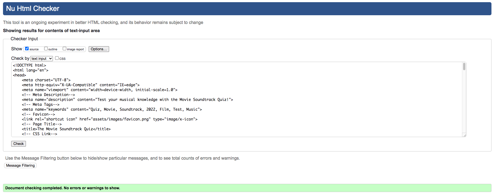

# **_The Movie Soundtrack Quiz_**

The Movie Soundtrack Quiz is an online quiz where a user can test their movie soundtrack knowledge with a fun interactive game. 

The target audience is any movie fans with an interest in music or vice versa. The audience will mostly include teens and above. The majority of the audience will be middle aged men and women. 

The goal of this online quiz is to provide a fun and interactive game where users can test their knowledge about movie soundtracks for entertainment purposes. The layout should be easily accessible and intuitive for new users. The quiz content should be challenging and engaging to encourage repeated play throughs. Information should be well structured and presented. Navigation and interactive elements should be intuitive with clear purpose and functionality. The project should conform to the best practices of user experience design, accessibility and responsivity. 

Link to the live site - [The Movie Soundtrack Quiz](https://matthew-hurrell.github.io/movie-soundtrack-quiz/)

# Contents

* [**User Experience UX**](<#user-experience-ux>)
    * [User Stories](<#user-stories>)
    * [Wireframes](<#wireframes>)
    * [Site Structure](<#site-structure>)
    * [Design Choices](<#design-choices>)
    * [Typography](<#typography>)
    * [Colour Scheme](<#colour-scheme>)
* [**Features**](<#features>)
    * [**Existing Features](<#existing-features>)
    * [**Home Page**](<#home-page>)
        * [Background](<#background>)
        * [Border](<#border>)
        * [Container](<#container>)
        * [Title](<#title>)
        * [Text](<#text>)
        * [Buttons](<#buttons>)
        * [Rules](<#rules>)
    * [**Quiz**](<#quiz>)
        * [Countdown Timer](<#countdown-timer>)
        * [Progress Bar](<#progress-bar>)
        * [Score Counter](<#score-counter>)
        * [Question](<#question>)
        * [Audio](<#audio>)
        * [Play and Pause Icons](<#play-and-pause-icons>)
        * [Answer Buttons](<#answer-buttons>)
        * [Navigational Buttons](<#navigational-buttons>)
    * [**End**](<#end>)
        * [Final Score Display](<#final-score-display>)
        * [Quote](<#quote>)
        * [Home Button](<#home-button>)
    * [**Future Features**](<#future-features>)
* [**Technologies Used**](<#technologies-used>)
* [**Testing**](<#testing>)
     * [**Validator Tests**](<#validator-tests>)
     * [**Responsiveness Tests**](<#responsiveness-tests>)
     * [**Lighthouse Tests**](<#lighthouse-tests>)
     * [**Browser Compatibility**](<#browser-compatibility>)
     * [**Bugs**](<#bugs>)
* [**Deployment**](<#deployment>)
     * [**Project Deployment Via GitHub**](<#project-deployment-via-github>)
     * [**How to Fork a Repository Via GitHub**](<#how-to-fork-a-repository-via-github>)  
     * [**How to Create a Local Clone of a Project**](<#how-to-create-a-local-clone-of-a-project>)   
* [**Credits**](<#credits>)
    * [**Content**](<#content>)
    * [**Media**](<#media>)
    * [**Code**](<#code>)
*  [**Acknowledgements**](<#acknowledgements>)

# User Experience UX

## User Stories

* As a user I want to be able to fully understand the purpose of The Movie Soundtrack Quiz from the first page.
* As a user I want to be prompted to turn up/on my device volume before starting the quiz.
* As a user I want to be able to see a brief list of rules before starting the quiz.
* As a user I want the quiz content to be challenging but not impossible. 
* As a user I want the audio for each question to autoplay, but also have control over pausing and playing the audio.
* As a user I want each question to have a time limit which is fair but also challenging.
* As a user I want the audio to continue playing when I make my choice, or if the timer runs out, so I can continue to listen to the track until continuing to the next question.
* As a user I want to be guided through the quiz with intuitive and easy to understand navigation.
* As a user I want the quiz to look eye catching and professional.
* As a user I want a progress bar and question countdown which gives me a visual reminder of where I am in the quiz.
* As a user I want a score counter which automatically counts and displays my score during and at the end of the quiz.
* As a user I want to be shown visually if I have selected the right answer, and if I have not I wish to be shown the correct answer for each question before moving on.
* As a user I want to be able to navigate out of the quiz to the home page at any time.
* As a user I want to be able to replay the quiz multiple times and be presented with different questions. 
* As a user I want the audio to be clear and of good sound quality.
* As a user I want the quiz content to be diverse.
* As a user I want to be congratulated on completing the quiz and presented with my final quiz score.
* As a user I want to be able to easily navigate to the beginning of the quiz once I have finished. 

[Back to top](<#contents>)

## Wireframes 

The project templates and wireframes for The Movie Soundtrack Quiz were designed using [Balsamiq](https://balsamiq.com). There are some differences between the wireframes and the finished project because of design choices made during the creative process.

[Back to top](<#contents>)

## Site Structure 

The Movie Soundtrack Quiz uses a single HTML page (index.html) which is then manipulated using javascript events and functions to add and subtract elements into the document. A user can navigate through the quiz linearly using buttons that are displayed when needed. There is a home section, a rules section, a quiz section and finally an end section which is navigated to after completing the quiz. A user can move back and forth freely between the home page and the rules page before starting the quiz. A user can also navigate back to the home page at any time during the quiz. Navigation buttons include a start button to start the quiz, a rules button to display the quiz rules, a home button that is displayed throughout the quiz, a next button which displays the next question to the user after they have answered a question and an end button which displays when the user answers the final question of the quiz. 

[Back to top](<#contents>)

## Design Choices 

* ### Typography 

The font used for the majority of The Movie Soundtrack Quiz is Lato from [Google Fonts](https://fonts.google.com/). Lato was chosen for its clear lettering and approachable but professional tone. It was used in a variety of different font weights to highlight certain text elements. Font style italics was used for the quote element on the end page to capture the users attention.

The title font is an image generated from [1001 Fonts](https://www.1001fonts.com/movie-fonts.html?page=1). This was used to create a bolder and more thematic title which is more eye catching than a standard font. 

[Back to top](<#contents>)

* ### Colour Scheme 

The colour scheme used for The Movie Soundtrack Quiz is a combination of whites and blacks for text elements with blues and greens for buttons. The colours used for the quiz are intended to convey meaning and provide a visual aid to the user. Red is used on incorrect answers and green on correct answers to display that outcome to the user in an easy to understand way. 

The container elements are a slightly transparent white which enables the background to be just visible behind. Navigational button elements are blue or green with a linear gradient into a darker shade at the bottom. They also feature white text to provide better contrast. Answer buttons are simply white with black text so they are easy to read. But when hovered over the button background changes to a faint blue. There are also CSS classes for correct and incorrect that change the background colour of the answer buttons depending on the user choice. An incorrect answer changes the background colour to a linear gradient of red and a correct answer changes the background to a linear gradient of green. The container upper and lower border features multi-coloured film reel strips which adds some bright colour into the page. The progress bar features a purple strip which adds a new colour into the page palette and draws the users attention. The background image is a multi-coloured collage of movie posters which is very eye catching. A white linear gradient was added to the image to dull the colours slightly and to make it less distracting for the user. 

[Back to top](<#contents>)

# Features

The Movie Soundtrack Quiz contains many features that were designed to enhance the user experience. There are also many potential features that could be added and expanded on in the future. The page features are designed to conform to the best practices of user experience design and accessibility.

## Existing Features

### Home Page

The home page is the main landing page of The Movie Soundtrack Quiz. It is displayed first to the user when they open or refresh the page. The objective of this section is to provide the user with a clear purpose of the page in an appealing and eye catching way. Content is simple but colourful to encourage further interaction from the user.

[Back to top](<#contents>)

* ### Background

The background is used throughout all sections of the site to provide consistency. The background is an image of a large collage of movie posters. It was chosen to help to convey the theme of the quiz to the user in a visual way. The original image was too bright for a background image so a white linear gradient was added to fade the colours slightly to make them less distracting to the user.

[Back to top](<#contents>)

* ### Border

Another element reused throughout the site is the border top and bottom. These borders are images of multi-coloured film reel tapes. They were chosen to further convey the theme of the site to the user. The borders are colourful and help to draw the users eyes into the middle of the screen. The design is simple yet visually appealing.

[Back to top](<#contents>)

* ### Container

All the interactive elements of the site are positioned within the central container. This container is centralised into the middle of the screen on larger screens and is responsive on smaller screen sizes. The container has a white background which is slightly transparent to allow a small amount of the background to be seen. The container features a solid black border with a faint border shadow around the edge and borders. A simple white background was used to provide suitable readability and contrast to the text elements. 

[Back to top](<#contents>)

* ### Title

The main title is displayed on the landing page but is hidden in the following sections. The font is a form of word-art with a movie theme. The font is bold, capitalised and eye catching. The title is an image which is centralised in the container using flex box. The image max width is set to 80% of the container width and scales down on smaller screen sizes.

[Back to top](<#contents>)

* ### Text

There are two text elements on the landing page. The first element is a reminder to the user to check that their volume is turned up. This is a very important element as the quiz is very reliant on audio. It's crucial to display this visual reminder to the user first if they intend on starting the quiz. 
The second text element is a brief sentence which further conveys the intention of the site to the user. Text content is kept to a minimum to avoid clutter and confusion. 

[Back to top](<#contents>)

* ### Buttons

There are two buttons displayed on the main landing page of the site - start and rules. Navigation is kept simple to avoid confusion. The start button is coloured green with a linear gradient and white text. The rules button is coloured blue with the same linear gradient and white text. The hover effect scales up the buttons by 1.05 and adds a shadow with matching colour behind the buttons. Borders for the buttons are 1 pixel, solid and black. When interacted with, the start button starts the quiz by triggering the start javascript function. It also hides the first container and displays the second container with the quiz elements. The start button also triggers the questions array to be shuffled and for the first object in the array to be selected as the first question. The rules button hides the buttons and the bold text element and adds an unordered list of the rules into the other text element using javascript. It also displays a back button with the same styling as the rules button which returns the user back to the main loading page when clicked.

[Back to top](<#contents>)

* ### Rules 

The rules text element is added using javascript when the rules button is clicked on the main landing page. It is a simple unordered list of clear rules which helps the user understand the nature of the quiz before starting. Helpful information about what to expect during the quiz is displayed here as well as a back button to navigate back to the main landing page when the user is ready to start the quiz.

[Back to top](<#contents>)

### Quiz

The quiz section is the main section of The Movie Soundtrack Quiz. This section is displayed once the start button is clicked by the user. The quiz contents is all held within a container which is hidden until the start button is clicked. Multiple elements within the quiz container are manipulated and updated using javascript. 

[Back to top](<#contents>)

* ### Countdown Timer

The countdown timer is a simple text element that appears in the top left corner of the quiz container. The timer value is updated every second using a javascript interval and a countdown function. There is an if statement within the countdown function to check if the timer hits 0, if it does the interval timer is cleared and the timer stops. This also triggers the answer buttons to show the correct answer and for the next button to appear. The user cannot choose an answer if the timer runs out as the event listeners for the answer buttons are removed. 

[Back to top](<#contents>)

* ### Progress Bar

The progress bar is displayed at the top center of the quiz container and is seperated into two elements. The first element is a text element which displays the current question number to the user in a text based way. This number increases as the user continues through the quiz. The second element is a progress bar which is updated to display a users progress in the quiz in a more visual way. Each time a user clicks the next button to go to the next question the width of the inner progress meter increases within the progress bar. As there are twelve questions the percentage width increase is 8.33% per question. The width is adjusted using javascript. The colour of the progress bar meter is purple to make the element more eye catching to the user.

[Back to top](<#contents>)

* ### Score Counter

The score counter is displayed at the top right hand corner of the quiz container. It is a text based score which is incremented by one and saved to a javascript variable each time a user makes a correct choice. This variable is then displayed in the score element. The font used for the score is larger and bolder than the other text to make it more visible to the user.

[Back to top](<#contents>)

* ### Question

The question element is a simple text element which is displayed in a larger and bolder font and centralised in the container. The question element is saved within an object within the javascript question array. Each object has question, audio, answer and correct properties with values which are then added to the current question the user is viewing. Although all the questions are currently the same, the question is still being added from the javascript property question from each question object. If the timer runs out and the timeout javascript function is called the text inside this element is changed to "Sorry you have run out of time!" to clearly indicate to the user that they have run out of time.

[Back to top](<#contents>)

* ### Audio

The audio element is hidden from the page. Audio is set to autoplay when a user is on a the quiz section of the site but it can be controlled using the pause and play icons. Each question object has an audio property which has the value of the file name for the correct audio for that question. Every time a new question is required the audio for that question is selected and played using the file reference from the question object.

[Back to top](<#contents>)

* ### Play and Pause Icons

The pause and play icons are displayed above the answer buttons. They are centralised to the middle of the container and feature black and white colour styling with a thick circular border. Only one icon displays at a time. A javascript function called audioControls checks if the audio is playing and displays either the play or pause icon depending on what the audio is doing. This cuts down on clutter and allows for a more user friendly experience. The icons feature a hover effect which scales the icons by 1.05 and adds a black border shadow.

[Back to top](<#contents>)

* ### Answer Buttons

The answer buttons are the interactive elements that the user can use to answer the current question. There are four buttons, each with one answer option which contains text from the selected question object in the questions array. Each question object has four answer properties and a correct property. Each of these answer property values are displayed within a corresponding answer button. When a user clicks a button to make a choice, a javascript function called checkAnswer checks the text content of the answer button against the value of the question object property correct. This property has the same value as the correct answer within the answer buttons. If the button selected by the user is correct, a CSS class of correct is added to the button to make the background colour change to green to symbolise the correct answer. If the answer is incorrect a CSS class of incorrect is added to the button to change the colour to red. For the incorrect answer, the buttons are then iterated through to check for the correct answer and this button then has the class of correct added to it. The buttons have a hover effect of a light blue background and also a scale of 1.05. Event listeners are removed from all the answer buttons when a choice is made or if the timer runs out so a user cannot make a further choice. They are then re-added for the next question when the user clicks the next button.

[Back to top](<#contents>)

* ### Navigational Buttons

The quiz section features three navigational buttons. These buttons are home, next and end. The home button is always visible and provides the user with a way of exiting the quiz at any time to go back to the home page. The next button is hidden but becomes visible when a user makes a choice for a question or runs out of time. The next button is used to move the user to the next question in the questions array. When the next button is clicked a new question is displayed on the elements of the quiz section, the timer is reset, the new audio is played and the answer button classes are also reset. The score is also recorded and displayed. The previous question is also removed from the question array. Each time a question is answered by a user an if statement is run within the correct and incorrect functions to check if the array length has reached a certain length. There are currently 27 questions in the question array and the quiz length is 12 questions long. The if statement checks if the array length is equal to 16 and if it is it knows the user has reached the last question. At this time the end button is displayed instead of the next button. When the end button is clicked the user is sent to the end section and the quiz container and all its elements are hidden from display. All buttons are consistent in styling with previous buttons. Green and blue colours are used and hover and border effects are the same. Blue coloured buttons are used for home buttons and green buttons are used to progress the user to the next relevant section. 

[Back to top](<#contents>)

### End

The end section is the last section of The Movie Soundtrack Quiz site. It is the section navigated to after the user clicks the end button on the quiz. Styling is consistent with the other sections of the quiz. Content is kept clear and basic to avoid clutter and confusion.

[Back to top](<#contents>)

* ### Final Score Display

The final score for the users quiz is saved to a javascript variable and added into the final score display text element in the end section. The font is large and bold and positioned at the top of the section. The user is congratulated for completing the quiz.

[Back to top](<#contents>)

* ### Quote

When the user clicks the end button to complete the quiz the final score is used to iterate through a movie quotes array. There are thirteen quotes in the array, each one corresponds to a different user score. The quote object is then selected by the users score and is displayed in the end section quote element using JavaScript. This quote generator is based on the users score. Each time a user completes the quiz they will get a different quote if they scored differently. This adds an element of replayability for the user. The quote text has a font style of italics and is slightly larger and bolder. The quote also has a caption which is displayed just below it. The caption is also autofilled from the quotes array object.

[Back to top](<#contents>)

* ### Home Button

The last element in the end section is a home button which allows the user to navigate back to the landing page. The user can then retake the quiz if they wish. The styling is consistent with the other home page buttons with similar hover effects.

[Back to top](<#contents>)

## Future Features

The Movie Soundtrack Quiz has many potential features that could be added or improved. Here is a list of possible features to be added in the future.

* A playlist feature could be added at the end of the quiz to navigate the user to a playlist of the audio that was featured during their quiz. This playlist could display the track name and composer/artist name to the user so they could listen to the tracks seperately on a different platform.
* Movie poster images could be added to the answer buttons instead of text. This could be visually more appealing than just text.
* Easy, medium and difficult modes could be added to the quiz for the user to select a difficulty setting for their quiz questions.
* A high score section could be added where a user enters a username and thier score is saved to a list of high scores.
* More questions could be added with a better variety of question topics to increase replayability.

[Back to top](<#contents>)

# Technologies Used

* [HTML5](https://developer.mozilla.org/en-US/docs/Glossary/HTML5) - Provides the structure of the site information, elements and website content. 
* [CSS3](https://developer.mozilla.org/en-US/docs/Web/CSS) - Provides the styling of the HTML content.
* [JavaScript](https://www.javascript.com/) - Provides the site interactivity and function.
* [Balsamiq](https://balsamiq.com/) - Wireframing software used to plan and design the site templates.
* [GitPod](https://gitpod.io/) - An open source developer platform for remote development. Used to edit and build the site
* [GitHub](https://github.com/) - An online host for web and software development projects. Used to store the repository and deploy the finished website.
* [Git](https://git-scm.com/) - Software for tracking changes to files. Used with GitPod to add, commit and push code changes to the repository on GitHub. 
* [Affinity Photo](https://affinity.serif.com/en-gb/photo/) - A photo editing app available through the Apple store used to design and edit images for the site.
* [Apple Notes](https://www.icloud.com/notes) - A simple Apple app used to write and plan copy and content for the website.
* [Slack](https://www.icloud.com/notes) - An online messaging program designed for workplace collaboration. Used for advice and guidance from peers and tutors. 
* [TuneFab Spotify Music Converter](https://www.tunefab.com/sp-music-converter/) - Software used to download audio tracks from Spotify.

[Back to top](<#contents>)

# Testing

The Movie Soundtrack Quiz has been rigorously tested for bugs, errors and styling/layout issues throughout its development process. 

## Validator Tests

The HTML document index.html was tested using [The W3C HTML Markup Validation Service](https://validator.w3.org/) and passed showing no errors or warnings.

The CSS document style.css was tested using [The W3C CSS Markup Validation Service](https://jigsaw.w3.org/css-validator/) and passed showing no errors.

The JavaScript document script.js was tested using [JSHint Javascript Validation Service](https://jshint.com/) and passed showing no errors or warnings.

[Back to top](<#contents>)

## Responsiveness Tests

The Movie Soundtrack Quiz was tested for responsiveness on multiple physical devices and through [Chrome Developer Tools](https://developer.chrome.com/docs/devtools/), [Am I Responsive](https://ui.dev/amiresponsive) and [Responsive Design Checker](https://responsivedesignchecker.com/). Responsivity screen tests were conducted through Google Chrome on iPhone SE, iPhone XR, iPhone 12 Pro, Pixel 5, Samsung Galaxy S8+, Samsung Galaxy S20 Ultra, iPad Air, iPad Mini, Surface Pro 7, Surface Duo, Galaxy Fold, Samsung Galaxy A51/71, Nest Hub, Nest Hub Max and iPhone 6/7/8 with both portrait and landscape settings. No errors in layout, appearance or functionality were found on any devices. 

[Back to top](<#contents>)

## Lighthouse Tests

The Movie Soundtrack Quiz was tested with [Chrome Dev Tools - Lighthouse](https://developers.google.com/web/tools/lighthouse) for performance, accessibility, best practices and SEO. The site passed all the tested criteria with 100 out of 100. 

[Back to top](<#contents>)

## Browser Compatibility

The Movie Soundtrack Quiz was tested on a multitude of different browsers to check for any compatibility issues. Browser compatibility tests were conducted on Google Chrome, Safari and Firefox with no visible issues apparent in layout, appearance or functionality. Responsiveness was also consistent across all browsers.

[Back to top](<#contents>)

## Bugs

The Movie Soundtrack Quiz was built using vanilla HTML, CSS and JavaScript. During development a number of unforeseen challenges presented themselves, and this consequently changed the features that were included in the final project. A lack of knowledge in back end languages limited the functionality of the site.

### Resolved 

* One of the biggest challenges with this project was finding reliable way to autoplay the audio for the user. Due to recent changes in regulations, audio and video is blocked from autoplaying until a user interacts with the site. During the early development process, the project was split into three seperate HTML pages including index.html for the home page, quiz.html for the quiz section and end.html for the end section. For a user starting at the home page and progressing through the quiz as intended this was not a problem, but if a user refreshed the quiz.html page the quiz would restart but audio would not autoplay as the user technically hadn't interacted with the page yet. After trying a few solutions it was decided the best way to resolve the issue was to combine all the HTML files into one document. This way if the user refreshed the page they would be sent back to the home page section and would have to click the start button before starting the quiz. This would then count as an interaction and the audio would autoplay as it should. This solution worked but it presented new issues that needed to be resolved.
* After the HTML documents were condensed into one HTML page the countdown timer was starting on the home page before the quiz was technically started by the user. This meant that for the first question the user had less than 60 seconds depending on how much time they spent on the home page. To resolve this issue the set interval for the javascript countdown timer had to be moved into the start game function so it was only called when the user clicked the start button.
* Another bug that presented itself during development was an issue with the audio control icons. Originally it was planned to have icons for play, pause, volume up and volume down always on display for a user to click to control the audio. But this was later revised as it cluttered the screen for the user unnecessarily. It was therefore concluded that it was best to just have one icon, either pause or play, on display at a time. To make this work there needed to be a function with an if statement to check if the audio was playing and to display the correct icon at that time. This ended up being more complicated than expected and created a number of bugs. One of these issues was if the music was paused during a question and the next button was clicked while the music was paused the icon wouldn't change to a pause button when the audio played for the next question. To rectify this problem the function was changed to be called every time a user clicks the next button. The function also needed to be called every time a user interacts with the audio icons. This solution solved the bug with the audio icons.
* There was also a minor issue with button links in the HTML document. The HTML validator passed errors for buttons being children of A links and vice versa. This was simply resolved by removing the A links from the buttons and creating a javascript function which sends the user to the desired location via window.open. After this was amended the HTML document passed the validator without any errors.

### Unresolved

* One unfortunate bug that still remains to be resolved is if a user clicks the pause button quickly after starting a new question the audio function to autoplay is interupted with the audio function pause and this causes the audio to show an error. This then stops the audio from playing. This isn't an error that should cause too many problems as it only happens if the pause button is clicked within a very quick tiem frame after the question is loaded. One possible way to resolve this would be to delay the functionality of the pause button for a couple of seconds until the audio is fully loaded so the user cannot interupt the audio at the start of each question. 

[Back to top](<#contents>)

# Deployment

## Project Deployment via GitHub Pages

The Movie Soundtrack Quiz repository is stored on GitHub. The site was created using GitPod and the live site is hosted on GitHub Pages. This is a guide to deploy a site on GitHub Pages using GitHub. 

1. Sign in to GitHub and find the repository in the repositories menu. 
2. Click to open the repository and click on the settings icon to open the settings menu for the repository.
3. In the settings menu, click on the pages tab on the left side of the screen.
4. Under source, select branch:main, leave the folder on root and click save. 
5. The page will then automatically refresh and provide a link to the published site when it has finished processing. 

When the site is live, a link to the site can also be found by navigating back to the repository and clicking on the github-pages link under the Environments title menu on the far right side. 

The live link for The Movie Soundtrack Quiz can be found here - [The Movie Soundtrack Quiz](https://matthew-hurrell.github.io/movie-soundtrack-quiz/)

[Back to top](<#contents>)

## How to fork a repository via GitHub

A copy of a local GitHub repository can be made by forking the GitHub repository. The purpose of this is to allow changes to be made to the copy without affecting the original repository. This is a guide to forking a repository on GitHub.

1. Sign in to GitHub, locate the repository and click to open the repository. 
2. On the right hand side of the repository menu there is a button called fork. Click the button to make a copy of the repository into your GitHub account. 

[Back to top](<#contents>)

## How to create a local clone of a project

This is a guide on how to clone a repository from GitHub. 

1. Sign in to GitHub, locate the repository and click to open the repository.
2. On the repository main page, click the code button above where the files are located. This will open a drop down menu.
3. In the dropdown menu stay on the HTTPS option and click the copy icon button next to the URL to copy it. 
4. Now minimise/close your browser and open your local IDE, e.g Visual Studio Code or Brackets.
5. Open Git Bash and change the current working directory to the file location you want the cloned directory to be made in.
6. Type git clone into the command line and then paste the URL copied from GitHub.
7. Press enter and the local repository clone will be created.

[Back to top](<#contents>)

# Credits

This section will credit the sources of code, tutorials, content and media for The Movie Soundtrack Quiz.

## Content

* Fonts were imported from [Google Fonts](https://fonts.google.com/).
* Icons were imported from [Font Awesome](https://fontawesome.com/).
* Question content was gathered using [Google Search](https://www.google.com/).
* Movie Quotes were obtained from the [American Film Institute](https://www.afi.com/afis-100-years-100-movie-quotes/).

## Media

* Audio content was sourced from [Spotify](https://open.spotify.com/).
* The movie collage background image was downloaded from [Reddit](https://i.redd.it/4fxxbm4opjd31.jpg).
* The border film reel was downloaded from [Dreamstime](https://www.dreamstime.com/stock-illustration-rainbow-flag-film-strip-frame-straight-shape-ribbon-design-element-white-background-lgbt-gay-movie-cinema-sign-symbol-isolated-image77231661).

## Code 

* The code used for the array randomizer is the Fisher-Yates shuffle. It was sourced from [Stack Overflow](https://stackoverflow.com/questions/2450954/how-to-randomize-shuffle-a-javascript-array).

[Back to top](<#contents>)

# Acknowledgements

The Movie Soundtrack Quiz was created as a second project submission for the [Code Insitute](https://codeinstitute.net/) Higher National Diploma of Full Stack Software Development. The project focusses on using vanilla JavaScript as well as HTML5 and CSS3. I really enjoyed my time working on this project and further developing my skills as a software developer. I learnt a lot about implimenting JavaScript functionality into a static web page to create an interactive user experience. 

I would like to take this opportunity to thank my mentor [Precious Ijege](https://www.linkedin.com/in/precious-ijege-908a00168/) for his help and encouragement throughout this project. I would also like to thank the Code Institute Slack community, specifically the class of May 2022 for their support and feedback. Thank you to the Code Institute student care team and the tutor assistance. 

I'm very much looking forward to my third project and continuing my journey as a software developer. 

Happy coding!

Matthew Hobbs-Hurrell

